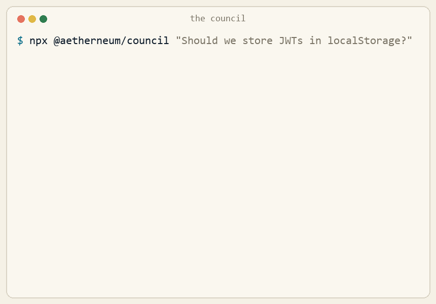

<div align="center">

# ◇ The Council

### One model has an opinion. A council reaches a verdict.

**Convene a panel of AI models on any decision — a PR, an RFC, an architecture call, a claim —
and get one structured verdict: `approve` · `revise` · `veto`, plus exactly where the models disagree.**

[](#-quickstart-30-seconds)
[](LICENSE)
[](https://nodejs.org)
[](#-use-it-in-ci-github-action)
[](https://github.com/aetherneum-network/council)

[Quickstart](#-quickstart-30-seconds) · [Why](#-why-a-council) · [CI Action](#-use-it-in-ci-github-action) · [How it works](#-how-it-works) · [Seats](#-seats--bring-your-own-keys)



</div>

---

A single LLM review is one voice with one set of blind spots. **The Council** asks several
different models the same question *independently*, then aggregates them into one verdict —
and tells you **where they split**. Disagreement between models is signal: it's exactly the
place a human should look.

- **Multi-model by default** — Claude, Llama, Qwen, Kimi, GPT, DeepSeek, Mistral, Grok… whoever you have keys for.
- **A real verdict, not a vibe** — `approve` / `revise` / `veto` / `abstain`, with confidence and a quorum.
- **Disagreement is the product** — every split and every risk is surfaced, not averaged away.
- **One command** — `npx @aetherneum/council "…"`. No install, no account, no telemetry.
- **CI-native** — a GitHub Action that reviews every PR and posts a single sticky verdict.
- **Zero lock-in** — open source (Apache-2.0), zero runtime dependencies, your keys never leave your machine.

## ⚡ Quickstart (30 seconds)

```bash
# bring at least one key — the Council is whoever you invite
export ANTHROPIC_API_KEY=...        # and/or GROQ_API_KEY, OPENAI_API_KEY, …

# zero-install, runs straight from the repo:
npx github:aetherneum-network/council "Should we store session JWTs in localStorage?"
```

Review an artifact, not just a question:

```bash
npx github:aetherneum-network/council -f rfc.md "Is this design sound for 10k concurrent users?"

git diff | npx github:aetherneum-network/council "Review this change before I merge it"

# no keys handy? see a recorded example:
npx github:aetherneum-network/council --demo
```

> Prefer a global command? `npm i -g github:aetherneum-network/council` then just `council "…"`.
> (Coming to the npm registry as `@aetherneum/council`.)

> ⭐ **If this saves you one bad merge, give it a star.** It's how other people find it.

## 🤔 Why a council?

|  | Single-model review | **The Council** | Human-only review |
|---|:---:|:---:|:---:|
| Catches one model's blind spots | ❌ | ✅ | ✅ |
| Surfaces *disagreement* explicitly | ❌ | ✅ | ⚠️ slow |
| Verdict in seconds | ✅ | ✅ | ❌ |
| Runs on every PR, unattended | ⚠️ | ✅ | ❌ |
| Cost | $ | $$ | $$$$ |
| You pick the models | ⚠️ | ✅ | — |
| Open source, no vendor lock-in | ⚠️ | ✅ | — |

A single model that's confidently wrong gives you one confident wrong answer.
Three models that disagree give you a **map of the uncertainty**.

## 🔁 Use it in CI (GitHub Action)

Drop this in `.github/workflows/council.yml` — the Council reviews every PR and posts one sticky comment:

```yaml
name: Council review
on: pull_request
permissions:
  contents: read
  pull-requests: write
jobs:
  council:
    runs-on: ubuntu-latest
    steps:
      - uses: actions/checkout@v4
        with: { fetch-depth: 0 }
      - uses: actions/setup-node@v4
        with: { node-version: 20 }
      - uses: aetherneum-network/council@v0
        with:
          fail-on: veto          # fail the check only on a quorum veto (optional)
        env:
          ANTHROPIC_API_KEY: ${{ secrets.ANTHROPIC_API_KEY }}
          GROQ_API_KEY:      ${{ secrets.GROQ_API_KEY }}
          # add any other provider keys you want a seat for
```

The Council comments with the panel verdict, a per-seat table, **where the models disagree**, and a foldable list of risks raised.

## 🧠 How it works

```
            ┌──────────── your question / diff / RFC ────────────┐
            ▼              ▼              ▼              ▼
      Claude (seat)  Llama (seat)  Qwen (seat)   Kimi (seat)     ← independent, parallel
            │              │              │              │
            └──────────────┴──────┬───────┴──────────────┘
                                   ▼
                       quorum · dissent · risks
                                   ▼
                  ◇  PANEL VERDICT  +  where they split
```

1. Each **seat** (one model) reviews the item independently and returns a structured JSON verdict.
2. The Council tallies the votes (abstentions don't count toward quorum), picks the panel verdict, and **flags any veto**.
3. It computes the **agreement %** and lists every seat that dissented from the panel line — plus every concrete risk raised.

No averaging of prose, no "the model thinks…". Just: who voted what, how sure, and why.

## 🎟 Seats — bring your own keys

A seat activates **only** when its key is in your environment. No key, no seat.

| Provider | Env var | Default model (override with `COUNCIL_<ID>_MODEL`) |
|---|---|---|
| Anthropic Claude | `ANTHROPIC_API_KEY` | `claude-sonnet-4-20250514` |
| Groq (Llama) | `GROQ_API_KEY` | `llama-3.3-70b-versatile` |
| Cerebras (Qwen) | `CEREBRAS_API_KEY` | `qwen-3-235b-a22b` |
| Moonshot (Kimi) | `MOONSHOT_API_KEY` | `kimi-k2-0711-preview` |
| OpenAI | `OPENAI_API_KEY` | `gpt-4o` |
| DeepSeek | `DEEPSEEK_API_KEY` | `deepseek-chat` |
| Mistral | `MISTRAL_API_KEY` | `mistral-large-latest` |
| xAI (Grok) | `XAI_API_KEY` | `grok-2-latest` |
| OpenRouter (any model) | `OPENROUTER_API_KEY` | `meta-llama/llama-3.3-70b-instruct` |

Narrow the panel with `COUNCIL_SEATS=anthropic,groq`. Any OpenAI-compatible endpoint
(Together, local Ollama / LM Studio, …) works via OpenRouter or a one-line registry entry.

## 🛠 CLI reference

```
council "<question>"            convene on a question
council -f <file> "<q>"         attach a file as the artifact
council --diff "<q>"            attach `git diff HEAD` as the artifact
git diff | council "<q>"        pipe an artifact in
council --json                  full machine-readable verdict
council --md                    Markdown report (PR comments)
council --fail-on veto          exit non-zero on a quorum veto (CI gate)
council --seats                 list the seats you have keys for
council --demo                  recorded example, no key needed
```

## 🌍 Translations

[English](README.md) · [Italiano](README.it.md) · [简体中文](README.zh-CN.md) — *translations welcome, [open a PR](CONTRIBUTING.md).*

## 🤝 Contributing

Adding a provider is usually one entry in [`src/providers.mjs`](src/providers.mjs). Bug reports,
new seats, and README translations are all welcome — see [CONTRIBUTING](CONTRIBUTING.md), or start a
thread in [Discussions](https://github.com/aetherneum-network/council/discussions).

## ◇ Who's behind it

The Council is the open-source core of the review protocol used at **[Aetherneum](https://aetherneum.com)** —
where every decision faces a panel of models before it ships. We extracted it so anyone can convene one.

<div align="center">

**[aetherneum.com](https://aetherneum.com)** · Apache-2.0 · *Per Æthera Ad Astra.*

⭐ **Star the repo** so the next person finds it.

</div>
